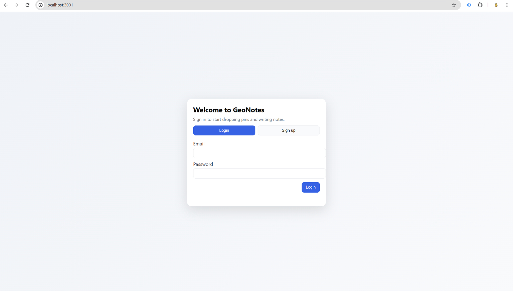
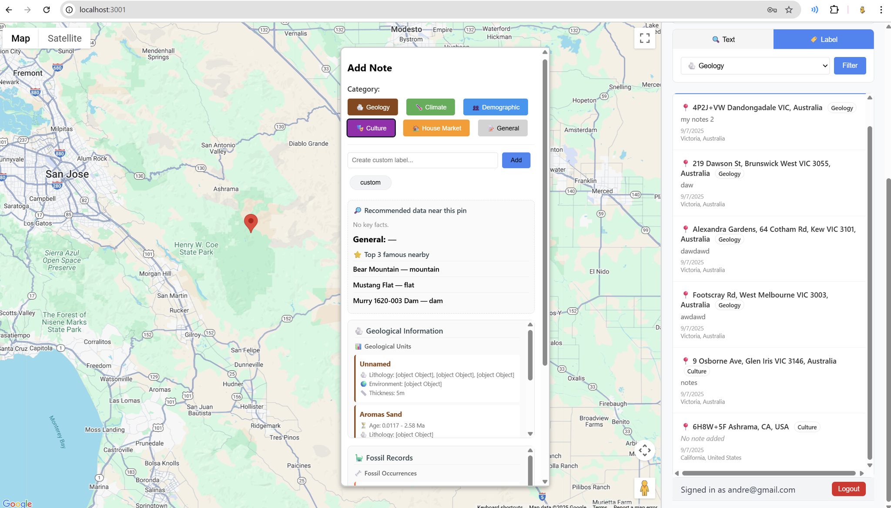

---

# 🌍 GeoNotes

GeoNotes is an interactive web application that lets users **drop pins on a live map**, attach notes, and explore **geological** and **fossil data** for any location on Earth. It combines custom notes with open scientific APIs, making learning about places engaging and fun.

---

## ✨ Features

* 📍 **Drop Pins**: Click anywhere on the map to add a pin with a custom note.
* 📝 **Categorize Notes**: Use built-in labels (Geology, Climate, Demographic, Culture, House Market, General) or create your own custom labels.
* 🔍 **Search & Filter**: Search pins by text or filter them by label.
* 🌐 **Location Context**: Pins automatically fetch country, region, and formatted address using Google Maps API.
* 🪨 **Geological Data**: Fetch stratigraphic and lithological information from the [Macrostrat API](https://macrostrat.org/).
* 🦕 **Fossil Records**: Display paleontological data from the [Paleobiology Database (PBDB)](https://paleobiodb.org/).
* 💾 **Persistent Storage**: Pins are stored in `pins.json` (file-based) and served through a Node.js/Express backend.
* 🎨 **Responsive UI**: Clean sidebar and notes panel with search, filtering, and styled data panels.

---

## 🛠️ Tech Stack

* **Frontend**: HTML, CSS, JavaScript (Google Maps API)
* **Backend**: Node.js, Express, CORS, dotenv
* **Database**: File-based JSON storage (pins.json); optionally connect MongoDB via `MONGO_URI`
* **External APIs**:

  * Google Maps Geocoding
  * Macrostrat Geological API
  * Paleobiology Database (PBDB)

---

## 📦 Installation

### 1. Clone the Repository

```bash
git clone https://github.com/your-username/geonotes.git
cd geonotes
```

### 2. Backend Setup

```bash
cd backend
npm install
```

* Create a `.env` file:

```env
MONGO_URI=mongodb://localhost:27017/geonotes
PORT=3001

GOOGLE_API_KEY= YOUR_API_KEY
```
for Google API, go onto Google Map Platform and sign up. 

* Start the server:

```bash
npm run dev   # with nodemon
npm start     # without nodemon
```

Server will run at: `http://localhost:3001`

### 3. Frontend Setup

```bash
cd ../frontend
npm install
```

* Start the development server:

```bash
npm run dev
```

Frontend runs at: `http://localhost:3001`

---

## 🚀 Usage

1. Open the frontend in your browser.
2. Click anywhere on the map to add a pin.
3. Add a note, select a label, or create a custom category.
4. Explore geological and fossil data fetched from external APIs.
5. Use the sidebar to search, filter, and manage your pins.

---

## 📸 Screenshots

*(Add screenshots of the map, sidebar, and notes panel here)*

---

## 🔮 Future Improvements
* [ ] Deploy on website
* [ ] Switch from file-based storage to MongoDB persistence.
* [ ] Add user authentication and personal pin collections.
* [ ] Enable sharing pins with friends or exporting them.
* [ ] Add climate and demographic APIs for richer context.

---



## ⚖️ License

This project is licensed under the **ISC License**.

---
